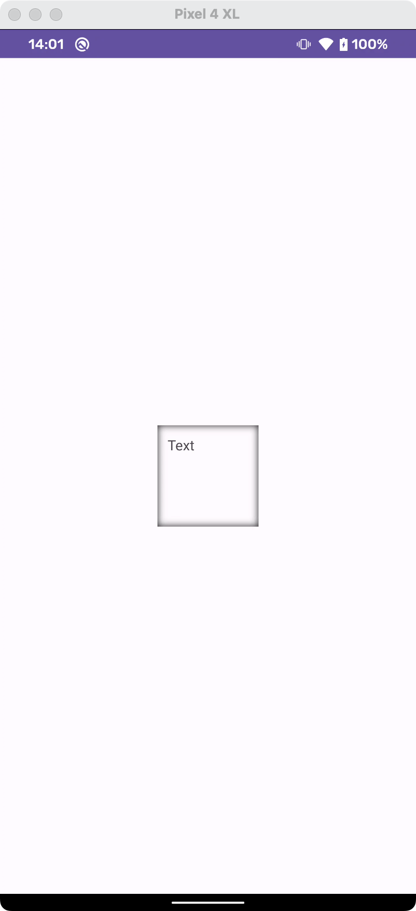
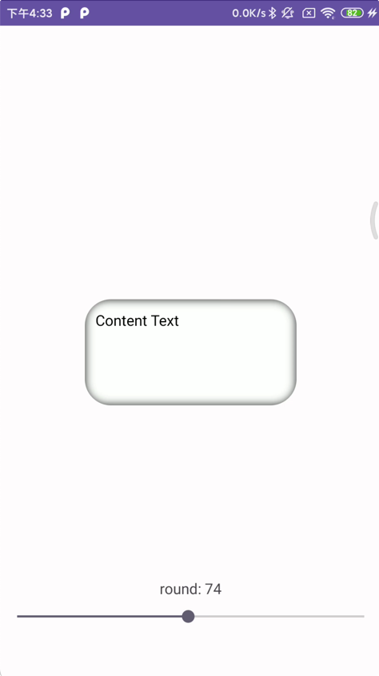

# InnerShadowView


View attrs:

| name         | type      | default |
| ------------ | --------- | ------- |
| cornerRadius | dimension | 0dp     |
| shadowColor  | color     | #000000 |


Example:

```xml
    <com.skit.view.InnerShadowView
        android:id="@+id/shadow_view"
        android:layout_width="200dp"
        android:layout_height="100dp"
        android:background="@color/white"
        android:padding="10dp"
        app:cornerRadius="16dp"
        app:shadowColor="#000000">

        <androidx.appcompat.widget.AppCompatTextView
            android:layout_width="wrap_content"
            android:layout_height="wrap_content"
            android:text="Content Text"
            android:textColor="@color/black" />
    </com.skit.view.InnerShadowView>
```


Normal:



Corner radius:

